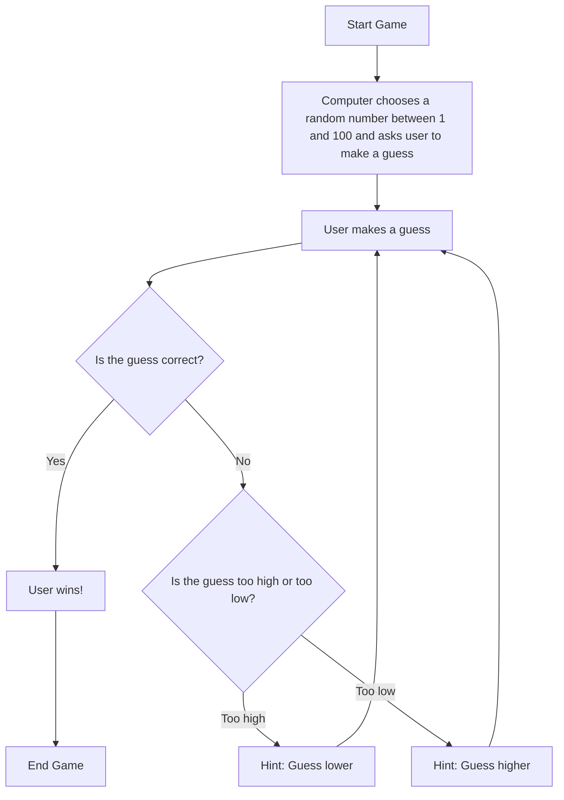

#### Mermaid Flowchart description

1. The computer asks the user to enter a number between 1 and 100  
2. The user enters a guess  
 If its is right the user wins  
 If it is wrong the user is given a hint
3.  The computer checks what is wrong with the guess  
 If the guess is too high, it tells the user to guess lower  
 If the guess is too low, it tells the user to guess lower
4. The process repeats until the user guess the number and wins!

